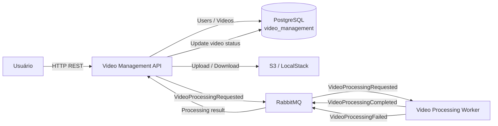

readme# fiapx-video-management-api
# FIAP X — Video Management API

API responsável pelo gerenciamento dos usuários e vídeos da solução FIAP X Video Processing.

A aplicação é responsável pelo fluxo síncrono de entrada e consulta dos vídeos e pelo disparo/recebimento do processamento assíncrono através do RabbitMQ.

---

## 1. Responsabilidades

O `video-management-api` concentra as responsabilidades de:

- autenticação de usuários;
- cadastro de usuários;
- login e geração de JWT;
- upload de vídeos;
- persistência dos metadados dos vídeos;
- consulta dos vídeos do usuário autenticado;
- consulta do status de um vídeo;
- disponibilização do arquivo processado;
- publicação de solicitações de processamento;
- consumo dos eventos de conclusão e falha enviados pelo Worker.

O processamento de vídeo e a execução do FFmpeg não fazem parte deste serviço.

---

## 2. Arquitetura



A API não acessa o banco do Worker.

A comunicação entre os dois serviços ocorre através do RabbitMQ.

---

## 3. Stack

- Python 3.12
- FastAPI
- SQLAlchemy
- PostgreSQL
- Pydantic / Pydantic Settings
- JWT
- bcrypt
- RabbitMQ
- S3-compatible storage
- Docker
- Kubernetes
- GitHub Actions
- Datadog

---

## 4. Fluxo de upload

O fluxo principal é:

```text
Cliente
   │
   │ POST /api/videos
   ▼
Video Management API
   │
   ├── valida usuário
   │
   ├── recebe arquivo
   │
   ├── salva arquivo no S3
   │
   ├── cria registro do vídeo
   │
   └── publica VideoProcessingRequested
               │
               ▼
           RabbitMQ
               │
               ▼
       Video Processing Worker
```

A API não aguarda o processamento do vídeo para responder ao upload.

O processamento ocorre de forma assíncrona.

---

## 5. Autenticação

A API utiliza autenticação baseada em JWT.

### Cadastro

```http
POST /api/auth/register
```

O usuário fornece:

```json
{
  "username": "user",
  "email": "user@example.com",
  "password": "password"
}
```

### Login

```http
POST /api/auth/login
```

Retorna um token de acesso:

```json
{
  "access_token": "<jwt>"
}
```

O token é utilizado nas operações protegidas da API.

### Segurança

A aplicação utiliza:

- bcrypt para hash de senha;
- JWT para autenticação;
- chave secreta configurada por variável de ambiente;
- algoritmo JWT configurável;
- tempo de expiração configurável.

A chave secreta não deve ser versionada.

---

## 6. Endpoints

### Authentication

| Método | Endpoint | Descrição |
|---|---|---|
| POST | `/api/auth/register` | Cadastra usuário |
| POST | `/api/auth/login` | Autentica usuário |

### Videos

| Método | Endpoint | Descrição |
|---|---|---|
| POST | `/api/videos` | Envia vídeo para processamento |
| GET | `/api/videos/` | Lista vídeos do usuário |
| GET | `/api/videos/{video_id}` | Consulta um vídeo |
| GET | `/api/videos/{video_id}/download` | Faz download do ZIP processado |

As operações de vídeo são associadas ao usuário autenticado.

---

## 7. Isolamento por usuário

A API não permite que um usuário consulte ou faça download de vídeos pertencentes a outro usuário.

As consultas utilizam o `user_id` do usuário autenticado.

Conceitualmente:

```text
JWT
 │
 ▼
current_user
 │
 ▼
user_id
 │
 ├── list videos
 ├── get video
 └── download result
```

Esse isolamento também é aplicado no repository de vídeos.

---

## 8. Status do vídeo

Os vídeos utilizam os seguintes estados:

```text
QUEUED
PROCESSING
COMPLETED
FAILED
```

Fluxo normal:

```text
QUEUED
   │
   ▼
PROCESSING
   │
   ▼
COMPLETED
```

Em caso de erro:

```text
QUEUED
   │
   ▼
PROCESSING
   │
   ▼
FAILED
```

O status apresentado ao usuário é mantido no banco da API.

---

## 9. Persistência

A API possui um PostgreSQL próprio.

Banco:

```text
video_management
```

A API é responsável pelos dados do seu próprio domínio.

Principais entidades:

```text
users
videos
```

O Worker possui outro banco PostgreSQL e não acessa esse banco.

---

## 10. Storage

Os arquivos de vídeo são armazenados em um storage S3-compatible.

No ambiente local:

```text
LocalStack
```

Bucket:

```text
videos
```

### Vídeo de entrada

```text
videos/{video_id}/input/{filename}
```

### Resultado

```text
videos/{video_id}/output/frames.zip
```

A API utiliza o object key para referenciar o arquivo no storage.

---

## 11. RabbitMQ

A API utiliza RabbitMQ para comunicação assíncrona com o Worker.

Filas utilizadas:

```text
video-processing
video-processing-completed
video-processing-failed
```

### Solicitação de processamento

Após o upload, a API publica:

```text
VideoProcessingRequested
```

Exemplo:

```json
{
  "event_type": "VideoProcessingRequested",
  "video_id": "uuid",
  "user_id": "uuid",
  "input_object_key": "videos/{video_id}/input/{filename}"
}
```

### Processamento concluído

O Worker publica:

```text
VideoProcessingCompleted
```

A API utiliza esse evento para atualizar o vídeo para `COMPLETED`.

Exemplo:

```json
{
  "event_type": "VideoProcessingCompleted",
  "video_id": "uuid",
  "user_id": "uuid",
  "output_object_key": "videos/{video_id}/output/frames.zip",
  "frame_count": 150
}
```

### Processamento com erro

O Worker publica:

```text
VideoProcessingFailed
```

A API utiliza esse evento para atualizar o vídeo para `FAILED`.

Exemplo:

```json
{
  "event_type": "VideoProcessingFailed",
  "video_id": "uuid",
  "user_id": "uuid",
  "error_message": "FFmpeg failed"
}
```

---

## 12. Download do resultado

Depois que o processamento termina, o usuário pode solicitar:

```http
GET /api/videos/{video_id}/download
```

A API:

1. valida o usuário;
2. localiza o vídeo;
3. verifica a existência do resultado;
4. obtém o objeto no storage;
5. retorna o conteúdo como ZIP.

Content type:

```text
application/zip
```

Nome do arquivo:

```text
frames.zip
```

---

## 13. Tratamento de erros

Falhas de processamento são persistidas no registro do vídeo.

Exemplo:

```json
{
  "status": "FAILED",
  "error_message": "FFmpeg failed: ..."
}
```

O cliente pode consultar o status através de:

```http
GET /api/videos/{video_id}
```

---

## 14. Estrutura da aplicação

A aplicação utiliza separação por responsabilidades:

```text
app/
├── api/
│   └── routes/
│       ├── auth.py
│       └── videos.py
│
├── core/
│   ├── config.py
│   └── security.py
│
├── dependencies/
│   ├── auth.py
│   └── database.py
│
├── models/
│   ├── user.py
│   └── video.py
│
├── repositories/
│   ├── user_repository.py
│   └── video_repository.py
│
├── schemas/
│   ├── auth.py
│   ├── events.py
│   └── video.py
│
├── services/
│   ├── auth_service.py
│   ├── storage_service.py
│   └── video_service.py
│
├── messaging/
│   └── rabbitmq.py
│
├── database.py
└── main.py
```

### Camadas

```text
Routes
  ↓
Services
  ↓
Repositories / Infrastructure
  ↓
Database / Storage / RabbitMQ
```

As rotas são responsáveis pela interface HTTP.

Os services concentram as regras de negócio.

Os repositories concentram o acesso aos dados.

---

## 15. Configuração

As configurações são fornecidas através de variáveis de ambiente.

Principais grupos:

### Database

```text
DATABASE_URL
DB_HOST
DB_NAME
DB_PORT
```

### RabbitMQ

```text
RABBITMQ_HOST
RABBITMQ_PORT
RABBITMQ_USERNAME
RABBITMQ_PASSWORD
RABBITMQ_INPUT_QUEUE
RABBITMQ_COMPLETED_QUEUE
RABBITMQ_FAILED_QUEUE
```

### Storage

```text
S3_ENDPOINT_URL
S3_ACCESS_KEY_ID
S3_SECRET_ACCESS_KEY
S3_REGION
S3_BUCKET
```

### JWT

```text
JWT_SECRET_KEY
JWT_ALGORITHM
JWT_ACCESS_TOKEN_EXPIRE_MINUTES
```

Segredos devem ser fornecidos através de Secrets/variáveis de ambiente e não devem ser versionados.

---

## 16. Docker

A aplicação é empacotada como uma imagem Docker.

Exemplo de build:

```bash
docker build -t fiapx-video-management-api:test .
```

Executar os testes:

```bash
docker run --rm fiapx-video-management-api:test \
  pytest test -v
```

Executar testes com cobertura:

```bash
docker run --rm fiapx-video-management-api:test \
  pytest test \
  --cov=app \
  --cov-report=term-missing
```

---

## 17. Kubernetes

A API é executada no Kubernetes.

Recursos principais:

```text
ConfigMap
Secret
Deployment
Service
HPA
```

O Service expõe a API na porta HTTP.

Exemplo de acesso local:

```bash
kubectl port-forward \
  -n default \
  svc/video-management-api \
  8000:80
```

API:

```text
http://localhost:8000
```

---

## 18. Escalabilidade

A API é stateless em relação à sessão do usuário.

Os dados persistentes ficam em:

- PostgreSQL;
- S3;
- RabbitMQ.

Isso permite executar múltiplas réplicas da API.

A API também possui HPA configurado para permitir escalabilidade horizontal conforme utilização de recursos.

O processamento pesado não é executado pela API; ele é delegado ao Worker.

---

## 19. Testes

A API possui testes unitários cobrindo:

- repositories;
- services;
- rotas;
- autenticação;
- segurança;
- storage;
- regras de vídeo.

Resultado atual da suíte:

```text
49 passed
82% coverage
```

A cobertura é medida com `pytest-cov`.

---

## 20. CI/CD

O GitHub Actions executa os testes automaticamente.

Exemplo:

```yaml
- name: Run tests with coverage
  run: |
    pytest \
      --cov=app \
      --cov-report=term-missing \
      --cov-report=xml \
      --cov-fail-under=80
  env:
    PYTHONPATH: .
    DATABASE_URL: sqlite:///./test.db
    JWT_SECRET_KEY: test-secret-key-for-ci
    JWT_ALGORITHM: HS256
    JWT_ACCESS_TOKEN_EXPIRE_MINUTES: "30"
```

A pipeline falha automaticamente se:

- algum teste falhar;
- a cobertura ficar abaixo de 80%.

A `JWT_SECRET_KEY` utilizada no CI é exclusiva para testes e não representa uma credencial de ambiente real.

---

## 21. Observabilidade

A aplicação é integrada ao Datadog através da infraestrutura Kubernetes.

São disponibilizados dados de observabilidade como:

- logs;
- métricas;
- traces/APM.

A observabilidade permite acompanhar operações da API e integrações com recursos externos.

---

## 22. Fluxo completo do serviço

```text
1. Usuário autentica
        │
        ▼
2. JWT
        │
        ▼
3. Upload do vídeo
        │
        ▼
4. API salva arquivo no S3
        │
        ▼
5. API cria registro QUEUED
        │
        ▼
6. API publica VideoProcessingRequested
        │
        ▼
7. RabbitMQ
        │
        ▼
8. Worker processa vídeo
        │
        ├───────────────┐
        │               │
        ▼               ▼
 Completed           Failed
        │               │
        └───────┬───────┘
                ▼
           RabbitMQ
                │
                ▼
        Video Management API
                │
                ▼
        Atualiza status
                │
                ▼
        Usuário consulta
                │
                ▼
        Download do ZIP
```

---

## 23. Requisitos funcionais relacionados

| Requisito | Implementação |
|---|---|
| Processar múltiplos vídeos | Processamento assíncrono através do Worker |
| Suportar picos | RabbitMQ + múltiplas réplicas do Worker |
| Username/password | Cadastro + login |
| Status por usuário | `GET /api/videos/` com isolamento por `user_id` |
| Persistência | PostgreSQL |
| Arquivos | S3-compatible storage |
| Comunicação assíncrona | RabbitMQ |
| Escalabilidade | Kubernetes + HPA |
| Testes | Pytest |
| Qualidade | 82% de cobertura |
| CI/CD | GitHub Actions |
| Observabilidade | Datadog |

---

## 24. Desenvolvimento local

Verifique o Kubernetes:

```bash
kubectl get nodes
```

Verifique os recursos da infraestrutura:

```bash
kubectl get pods -n video-infra
```

Depois de aplicar a infraestrutura, faça o deploy da API conforme os manifests do projeto.

Para acessar localmente:

```bash
kubectl port-forward \
  -n default \
  svc/video-management-api \
  8000:80
```

Documentação OpenAPI:

```text
http://localhost:8000/docs
```

---

## 25. Relação com o Worker

A API e o Worker são serviços independentes:

```text
video-management-api
        │
        │ RabbitMQ
        ▼
video-processing-worker
```

A API não executa:

- FFmpeg;
- extração de frames;
- criação do ZIP;
- processamento pesado do vídeo.

Essas responsabilidades pertencem ao Worker.

O contrato entre os dois serviços é baseado nos eventos:

```text
VideoProcessingRequested
VideoProcessingCompleted
VideoProcessingFailed
```

Essa separação permite escalar o processamento independentemente da camada HTTP.
