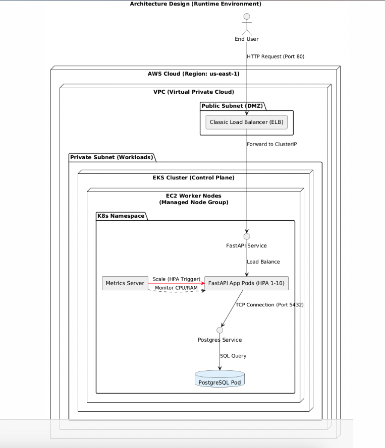
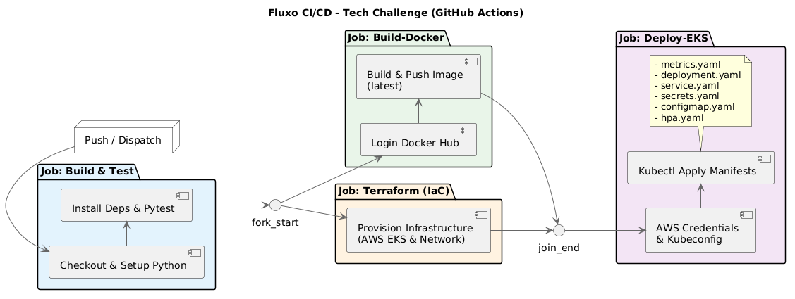

# Tech Challenge – API de Ordem de Serviço (Fase 2 - Qualidade, Resiliência e Escalabilidade)

## 📝 Descrição da Solução e Objetivos
Esta fase do projeto foca na modernização da infraestrutura da API de Ordem de Serviço, priorizando **disponibilidade, escalabilidade automática e resiliência**. A aplicação foi migrada para um ambiente orquestrado por **Kubernetes (K8s)**, permitindo que o sistema suporte variações de carga sem intervenção manual e otimize o uso de recursos computacionais.

### Objetivos Principais:
* **Provisionamento Automatizado:** Uso de Terraform (IaC) para criar um cluster EKS (Elastic Kubernetes Service) na AWS de forma replicável.
* **Auto-scaling (HPA):** Implementação de escalonamento horizontal automático para gerenciar réplicas com base no consumo real de CPU e Memória.
* **Conteinerização Eficiente:** Dockerização da aplicação com definição rigorosa de `resources` (requests/limits) para garantir estabilidade e previsibilidade de custos.
* **Observabilidade Local e Cloud:** Configuração do Metrics Server para monitoramento de performance em tempo real em ambos os ambientes.

Mais informações acesse: [API Details](docs/infos.md).

---

## 🏗️ Desenho da Arquitetura



### Componentes da Aplicação
1.  **FastAPI Backend:** API Python de alta performance utilizando SQLAlchemy e JWT.
2.  **PostgreSQL Pod:** Instância de banco de dados relacional rodando via StatefulSet/Deployment para persistência.
3.  **Metrics Server:** Agregador de dados de uso de recursos, essencial para alimentar o HPA.
4.  **HPA Controller:** Monitora os pods e escala dinamicamente entre 1 e 10 réplicas.

### Infraestrutura Provisionada (AWS)
* **Networking:** VPC dedicada com Subnets públicas/privadas, Route Tables e Internet Gateway.
* **Compute:** Cluster AWS EKS utilizando um Node Group com instâncias `t3.medium`.
* **Load Balancer:** AWS Classic Load Balancer (ELB) expondo o serviço para tráfego externo.

### Fluxo de Deploy


1.  **Infraestrutura (Terraform):**
    * O comando `terraform apply` provisiona a fundação de rede (**VPC, Subnets**) e o cluster **AWS EKS (EKS-FIAP)**.
    * Configura o **Node Group** (instâncias EC2) que servirão de hospedeiros para os containers.

2.  **Publicação de Artefatos (Docker Hub):**
    * Após o sucesso dos testes, o pipeline realiza o **Build** da imagem Docker da API FastAPI.
    * É efetuado o **Push** da imagem para o **Docker Hub** (ex: `usuario/tech-challenge:latest`).

3.  **Contexto e Autenticação:**
    * O pipeline configura as credenciais AWS e utiliza o `aws eks update-kubeconfig` para autenticar o `kubectl` no cluster em `us-east-1`.

4.  **Deploy Sequencial de Manifestos:**
    * O Kubernetes recebe a ordem de deploy e instrui os **Worker Nodes (EC2)** a realizarem o **Pull** da imagem recém-criada no **Docker Hub**.
    * A aplicação dos manifestos segue a ordem:
        * **Configuração:** `secrets.yaml` e `configmap.yaml`.
        * **Observabilidade:** `metrics.yaml` (Metrics Server).
        * **Persistência:** `deployment.yaml` e `service.yaml` do **PostgreSQL**.
        * **Aplicação:** `deployment.yaml` e `service.yaml` da **API** (instanciando os Pods com a imagem do Docker Hub).
        * **Escalabilidade:** `hpa.yaml`.


---

## 🚀 Instruções para Execução Local

### Pré-requisitos
* Docker

### 1️⃣ Clonar o repositório
```bash
git clone https://github.com/AnaGli/tech-challenge-phase-1.git
cd TECH-CHALLENGE
```

### 2️⃣ Criar o arquivo .env
Crie um arquivo `.env` na raiz do projeto com as seguintes variáveis:
```env
POSTGRES_USER=postgres
POSTGRES_PASSWORD=postgres
POSTGRES_DB=fastapi-db
DATABASE_URL=postgresql://postgres:postgres@db:5432/fastapi-db
SECRET_KEY="CHANGE_ME_SECRET"
ALGORITHM=HS256
```

### 3️⃣ Subir a aplicação
```bash
docker compose up --build
```
**Esse comando irá:**
* Subir o banco PostgreSQL.
* Aplicar automaticamente as migrations (Alembic).
* Subir a API FastAPI.

### 4️⃣ Acessar a aplicação
* **API:** http://localhost:8000
* **Documentação Swagger:** http://localhost:8000/docs

---

## 🧪 Execução de Testes

```
docker exec -it fastapi_app pytest
```

## Provisionamento com Terraform
1.  **Inicie e aplique a infraestrutura:**
    ```bash
    terraform init
    terraform apply --auto-approve
    ```
---
### 💻 Execução Local (Kubernetes)

 Certifique-se de que o contexto do `kubectl` está correto (`kubectl config use-context docker-desktop`).


### Preparação e Configurações de Base
Cria as variáveis de ambiente, credenciais e configurações do banco
```
kubectl apply -f k8s/metrics.yaml
kubectl apply -f k8s/deployment.yaml
kubectl apply -f k8s/service.yaml
kubectl apply -f k8s/secrets.yaml
kubectl apply -f k8s/configmap.yaml          
kubectl apply -f k8s/hpa.yaml
```

### Acesso e Monitoramento Local
Encaminha a porta do serviço para o seu localhost
```
kubectl port-forward service/fastapi-service 8000:8000 &
```
Verifique se o HPA está lendo as métricas (pode levar 1-2 min):
```
kubectl get hpa -w
```
Aceda à documentação interativa (Swagger):
URL: http://localhost:8000/docs

### Comandos de Inspeção Úteis
Ver logs da API em tempo real:
```
kubectl logs -f deployment/fastapi-app
```
Descrever o estado do HPA (em caso de erro no scaling):
```
kubectl describe hpa fastapi-hpa
```
### Limpeza Geral
Remove todos os recursos criados pelos manifestos da pasta
```
kubectl delete -f k8s/
```
## 🛠️ Refatoração e Arquitetura

Este projeto foi refatorado para seguir os princípios de **Clean Architecture**, eliminando o acoplamento direto entre as rotas da API e o banco de dados através da introdução de uma camada de **Services**. As regras de negócio, validações de duplicidade (como CPF e placas) e cálculos complexos (como baixa de estoque e métricas de tempo) foram movidos dos *Routers* para classes de serviço especializadas, garantindo que os controladores do FastAPI foquem exclusivamente no contrato HTTP e na orquestração de dependências.

Além da nova camada lógica, o sistema de estados das Ordens de Serviço foi padronizado com o uso de **Enums**, eliminando inconsistências de strings e falhas em transições de status. Os **Repositories** foram simplificados para atuarem como uma camada de persistência pura, enquanto a segurança foi reforçada com a aplicação consistente de dependências de autenticação em todos os módulos críticos. Essa estrutura promove uma base de código modular, facilitando a escrita de testes unitários e a futura escalabilidade da aplicação.

### 📂 Estrutura de Pastas Padrão

Com as mudanças realizadas, a arquitetura do projeto deve refletir a seguinte hierarquia de responsabilidades:

* **`app/routers/`**: Camada de interface. Contém apenas as definições de rotas (endpoints), tratamento de parâmetros de entrada e chamadas diretas aos *Services*.
* **`app/services/`**: Camada de aplicação (Cérebro). Onde reside toda a lógica de negócio, cálculos, orquestração de múltiplos repositórios e validações de regras.
* **`app/repositories/`**: Camada de infraestrutura. Focada estritamente em comandos de persistência (SQL/SQLAlchemy), realizando operações de CRUD puro.
* **`app/models/`**: Camada de domínio. Contém as definições das tabelas do banco de dados (SQLAlchemy Models) e tipos globais como os **Enums**.