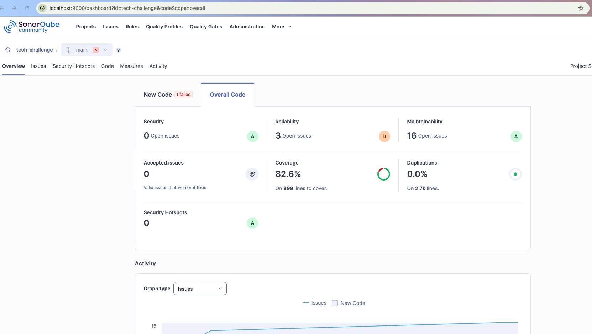

# Relatório de Análise de Qualidade – SonarQube

Este documento apresenta o consolidado da análise estática de código e cobertura de testes realizada no projeto **Tech Challenge – API de Ordem de Serviço**.

---

## 📊 Resumo das Métricas

Os dados abaixo foram recuperados via API do SonarQube local após a execução do scanner.

| Métrica | Valor | Status |
| :--- | :--- | :--- |
| **Cobertura de Código** | 82.6% | ✅ Ótimo (Acima da meta de 80%) |
| **Bugs** | 0 | ✅ Nenhum erro crítico encontrado |
| **Vulnerabilidades** | 0 | ✅ Segurança aprovada |
| **Code Smells** | 16 | ⚠️ Atenção (Necessita refatoração leve) |
| **Rating Geral** | 1.0 (A) | ✅ Excelente manutenibilidade |



---

## 🛠 Detalhamento Técnico

### 1. Cobertura de Testes
A cobertura de **82.6%** indica que a maior parte das regras de negócio, incluindo validações de CPF/CNPJ e fluxo de status da Ordem de Serviço, está protegida por testes automatizados.

### 2. Dívida Técnica (Code Smells)
Foram detectados **16 code smells**. Estes itens referem-se a:
* Melhoria na clareza de nomes de variáveis.
* Remoção de imports não utilizados.
* Redução de complexidade em funções específicas de cálculo de orçamento.

### 3. Segurança e Confiabilidade
O projeto atingiu a nota máxima em **Confiabilidade** e **Segurança**, com zero vulnerabilidades detectadas nos endpoints de clientes e autenticação.

---

## 📄 JSON de Origem (Raw Data)

Dados brutos extraídos da seguinte forma:
``` 
curl -u <token>: "http://localhost:9000/api/measures/component?component=tech-challenge&metricKeys=coverage,bugs,vulnerabilities,code_smells,sqale_rating" > métricas_projeto.json
``` 

```json
{
  "component": {
    "key": "tech-challenge",
    "name": "tech-challenge",
    "qualifier": "TRK",
    "measures": [
      { "metric": "coverage", "value": "82.6", "bestValue": false },
      { "metric": "bugs", "value": "0", "bestValue": true },
      { "metric": "code_smells", "value": "16", "bestValue": false },
      { "metric": "vulnerabilities", "value": "0", "bestValue": true },
      { "metric": "sqale_rating", "value": "1.0", "bestValue": true }
    ]
  }
}
```

---
*Relatório gerado em Janeiro de 2026.*